 

 

 

2021 Modern Cryptography Curriculum Design Task

# Summary

This paper is to write the modern cryptography curriculum practical experiment report, the implementation of the content mainly includes: DES Algorithm design, AES Algorithm design, ANSI X9.17 Algorithm to achieve pseudo-random number bit generator, Miller Ruobing primacy detection Algorithm, RSA key generation, AES-CBC model encryption, decrypt files, RSA encryption, decryption session key, etc. C++ language , developed based on Visual Studio 2019, mainly based on NTL library as an additional dependent static link library to realize the data structure and Function basis of prime detection, RSA encryption and decryption and other related Algorithms.

The final result implements three different plates for three different programming tasks: generate ALICE RSA key plate; BOB encrypts the file m and sends it to ALICE plate; ALICE decrypts and recovers the file m plate. In the programming process, attention is paid to details, file storage of the key, etc. In order not to introduce the influence of intermediate variables on the result, each plate is selected by the user independently, and the program is terminated after each set of plates mentioned above, and the program is called again for key generation, encryption or decryption next time.


# Chapter 1, Topic Background

## Programming tasks and requirements

### Alice generates RSA key:

#### description

Alice generates a pair of RSA Public key (n, b) and private key (p, q, a), where the random primes p, q are both 512 bits long, or 1024 bits long: both lengths are supported.

####  request

Based on open source code NTL implementation, NTL is a popular high-precision algebraic number theory library in the cryptography world. No other methods are supported. NTL URL: https://www.shoup.net/ntl/. There are detailed instructions on the website or in the downloaded doc.

Note: In order to ensure that the probability of passing the primacy test is large enough, it is necessary to test enough times, such as generating a 512-bit prime number, the probability that the number passing the test is not a prime number (that is, the error probability) is close to 1/2512.

### Bob encrypts file m and sends it to Alice:

####  description

1. The input file is of arbitrary length. How to convert the file to the required format, please decide by yourself. In the CBC model, if the length of m is not a multiple of the packet, you need to fill it, please decide how to fill it, but you need to remove the filling when decrypting.

2. Generate a 128-bit random number $k$ as a temporary session key.

3. Encrypt k with Alice's public key to get `c1 - kb mod n`.

4, with the session key k to encrypt the file m to obtain c2, where the encryption Algorithm is AES , using the CBC model.

5. Send *(c1, c2)* to Alice.

####  Requirements

AES column mixing operation and its inverse operation using fast Algorithm provided in my courseware. S-Box using look-up table to achieve. AES AES test data can refer to AES ash animation.

### 1.3 Alice decrypts and recovers file m

####  1.3.1 Description

Decrypt $c1 $with Alice's RSA private key to get $k $.

2. Decrypt $c2 $ with $k$ to get $m $.

3. Output $m $.

## Restriction requirements

The random numbers mentioned above (including random prime number generation, IV in CBC) should be generated by ANSI X9.17 Algorithm, and cannot be generated by the pseudo-random number Function provided by the system. Random numbers for cryptographic purposes need to be generated by the pseudo-random number Algorithm dedicated to cryptographic purposes.

Algorithm ANSI X9.17 Pseudorandom Number Bit Generator

Inputs: Random (secret) 64-bit seed $s $, integer $m $, two DES keys $k1, k2 $.

Output: $m $64-bit random bit strings $x_1, x_2,..., x_m $.

$ I = DES_ {k1} (DES_k2 ^ {-1} (DES_ {k1} (D))) $, where $D $ represents an exact representation of the current date/time, and $ DES $ represents DES encryption. $DES ^ {-1} $represents DES decryption.

2、`For i=1 to m`:
$$
x_i = DES_{k1}(DES_k2^{-1}(DES_{k1}(I\oplus s)))\\
s = DES_{k1}(DES_k2^{-1}(DES_{k1}(x_i\oplus I)))
$$
3, Returns $x_1, x_2,..., x_m $.

# Chapter 2, Programming Instructions

## Programming Overall Architecture

### RSA Encryption System Overall Framework

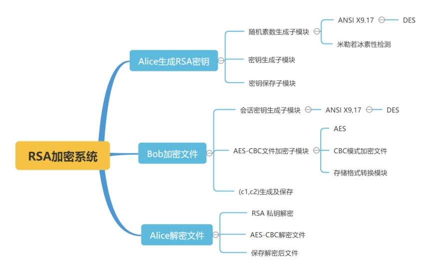 

The overall construction of the program is shown in the figure above. It mainly includes the content of three large sections:

1. Alice generates RSA key

Specifically, it involves three sub-modules: random prime generation, key generation and key storage, among which the random prime generation calls the $ANSI X9.17 random number generator (internal design triple DES Algorithm), and the Miller Ruo ice primacy detection module.

2. Bob encrypts files

Specifically, it relates to a temporary session key generation sub-module (including ANSI X9.17 random prime number generator internally), AES-CBC file encryption sub-module, and (c1, c2) ciphertext generation and preservation sub-module, wherein the AES-CBC file encryption sub-module internally contains AES Algorithm, CBC model encrypted file, storage format conversion three sub-modules.

3. Alice decrypts the file

Specifically, it involves RSA private key decryption, AES-CBC model decrypts the file, saves the file after decryption and outputs three sub-modules.

### 1.5 General framework for programming

In RSA In the Algorithm description described in the overall framework of the encryption system, the following core component modules are involved. It is organized here and used as the main framework for code generation:

1. DES Algorithm, as the core of ANSI X9.17 random number generator

2. ANSI X9.17, call DES Algorithm to generate random numbers

3. PrimeTest primality detection module, as the core guarantee of key generation

4. RSA Key generation module, calling the above module to generate RSA encryption, decryption keys

5. AES Algorithm, as the file encryption basis for 

6. AES-CBC file encryption/decryption, as the core module of file encryption

7. RSA Encryption/decryption. Use RSA own basis for encryption and decryption of session keys to call AES-CBC for file encryption and decryption to form a complete system

8. Top-level modules, integrate all the above-mentioned sub-top-level modules and realize functions

## Programming Detailed design instructions for each module

## Algorithm Design

### Algorithm principle

DES (Data Encryption Standard) is one of the most popular encryption algorithms. DES It is symmetric, which means that it uses the same key to encrypt and decrypt data.

DES It is also a packet encryption algorithm, which processes a fixed-length data segment at a time, called a packet. DES The size of the packet is 64 bits. If the length of the encrypted data is not a multiple of 64 bits, the bits can be filled according to some specific rules.

Essentially, DES The security of Plain Text relies on false appearances, which in cryptographic terms relies on the principle of "chaos and diffusion." The purpose of chaos is to hide any relationship between Plain Text and the ciphertext, or key, while the purpose of diffusion is to make the valid bits in Plain Text and the key together to form as many ciphertexts as possible. The combination of the two makes for relatively high security.

DES The algorithm encrypts the Plain Text by performing a series of permutations and substitutions. The key to the process is to obtain the Function of the 16 subkeys from the given initial key. To encrypt a set of Plain Text, each subkey is applied to the data in a series of bit operations in sequence (1-16), once for each subkey, repeating a total of 16 times. Each iteration is called a round. The same steps can be used to decrypt the ciphertext, except that the subkey processes the ciphertext in reverse order (16-1).

##### Calculate 16 subkeys

The above mentioned DES The first step of the Algorithm is to calculate 16 subkeys from the initial key. The illustration shows this process. DES use a 56-bit initial key, but here is a 64-bit value. This is because every 8 bits can be used for parity in the Hardware implementation, and the extra bits are simply ignored in the software implementation. To obtain a 56-bit key, you can perform key conversion as shown in License Table 1. Explain Table 1. Viewed from left to right, top to bottom, each position P in the table contains the position of the bit in the initial key in the converted key. For example, bit 57 in the initial key becomes bit 1 in the converted key, bit 49 in the initial key becomes bit 2 in the converted key, and so on....

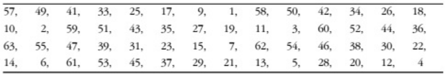 

Figure 2 DES Conversion table of keys in Figure 2 (DesTransform [56])

After converting the key to 56 bits, the sub-keys are calculated. First, the 56-bit key is divided into two 28-bit groups. Then, for each sub-key, according to the sequence value of the sub-key (that is, the number of bits in the 16 sub-keys), the two sets of values are rotated (see Table 2 for the number of bits rotated), and then merged again. Afterwards, the reconstituted key is replaced as shown in Table 3, so that the 56-bit sub-key is reduced to 48 bits (note that Table 3 only has 48 bits, but discards 8 bits). This arrangement process is called replacement selection.

For 16 subkeys, repeat the process once for each subkey. The purpose here is to ensure that different bits in the initial key are applied to the encrypted data after each round of permutation.

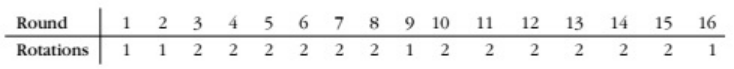 

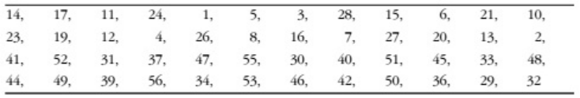 

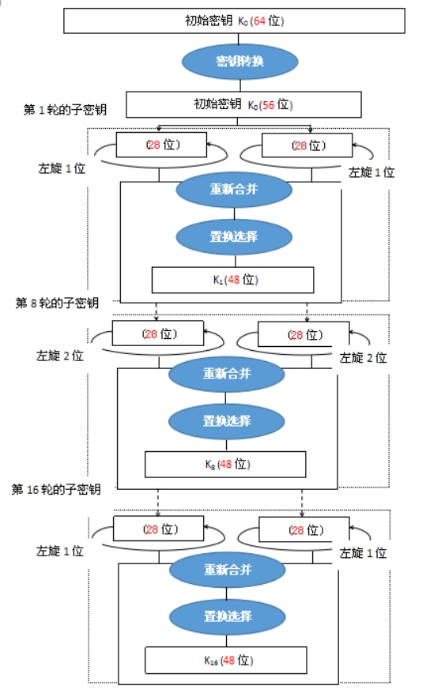 

 

#####  Encrypt and decrypt data block

After the above process, we have prepared the subkey. Then you can encrypt and decrypt the data block. Figure 2 shows this process.

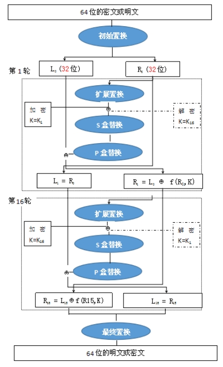 

Replacing a 64-bit data block in the way shown above begins, a process called initial permutation. This process does not increase the security of DES , but this practice made it easier to load data into DES chips before the advent of 16- and 32-bit buses. Although this process is outdated, the permutation process is still retained to meet DES criteria.

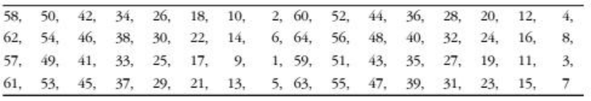 

After the initial permutation, the 64-bit data block is divided into two 32-bit groups, L0 and R0. After the initial permutation, the data block will repeat a series of operations for 16 rounds. The purpose of each round of operations ( i ) is to calculate Li and Ri, and these results will be used in the next round of operations until the data $R16 $and $L16 $are finally obtained.

Each round starts with $Li-1 $and $Ri-1 $, and then performs an extended permutation as shown in the table, expanding $R_ {i-1} $from 32 bits to 48 bits. The main purpose of this permutation is to create some avalanche effect in the process of encrypting data. Using 1 bit in the data block will affect more bits in the next operation, resulting in a diffusion effect.

Once the extended permutation is complete, calculate the exclusive OR of the 48-bit result value to this wheel key $K_i $ (**XOR**, in sign-wise). This produces a 48-bit intermediate value, denoted as $R_ {int} $.

If E is counted as the result of extended permutation, the operation so far in this round can be expressed as:

$$R_{int} = E（Ri-1) ⊕ Ki$$

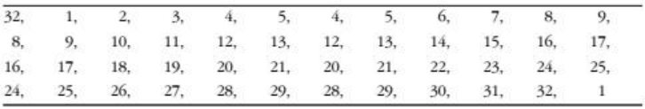 

Next, $R_ {int} $needs to perform 8 substitutions through 8 separate S boxes. Each S box (j) takes 6 bits from $6j $to $6j + 6 $of $R_ {int} $, finds a 4-bit value for it in the table, and writes the value to the buffer at $4j $.

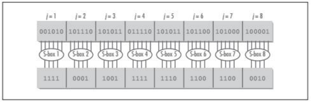 

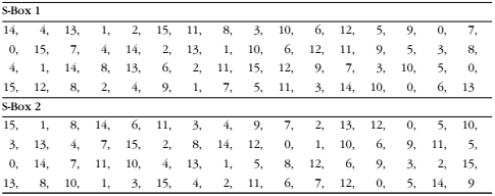 

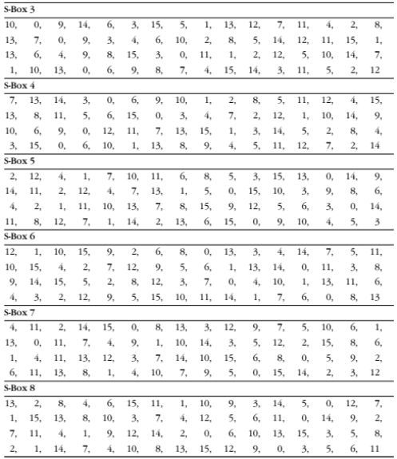 

Once the S-box replacement is complete, the result is changed to a 32-bit value. Next, replace it with the P-box. As shown in the table below.

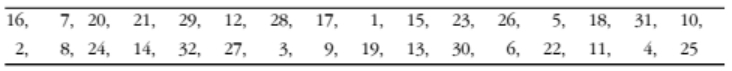 

So far, we have imagined this round of operations as a Function, generally denoted f. If $b_j $represents the $j $6-bit group in $R_int $, $S_j $represents the jth S-box, and P represents the P-box permutation, the Function can be defined as:
$$
f = P(S1(b1),S2(b2),...,S8(b8))
$$
The last operation of each round is to calculate the exclusive OR value between the 32-bit result value of f and the left packet Li-1 of the original data source passed to the current round of operations.

Once completed, the left and right packets are switched and the next round begins. In the last round, left and right packets are not exchanged.

Connecting all the steps, the steps to calculate $Li $and $Ri $in each round can be represented exactly as:
$$
L_i = R_i - 1\\
R_i = (L_i-1)\oplus F(R_i-1,K_i)\\
L_i = R_i -1
$$
When all 16 rounds of operations are completed, the last right packet $R16 $and the last remaining left packet $L16 $are connected to form a 64-bit packet $R16-L16 $.

The final step is to replace R16-L16. In short, undo the previous initial permutation. When encrypting the data, the end result is a 64-bit ciphertext, and when decrypting the data, the end result is a 64-bit Plain Text.

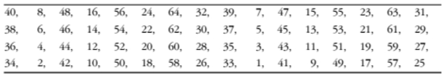 

#### DES Algorithm implementation

By establishing DES classes to encapsulate the corresponding data members and Function members, as well as external implementation and calling interfaces.

#####  data member

Data members mainly include initial permutation table, key initial permutation table, key cycle shift number table, key compression permutation table, data expansion table, s-box permutation table, final permutation table. A total of 8 tables and the initial key given to DES Encryption. The specific information is defined as follows:

```C++
class DES {
private:
/*** Data Initial Replacement Table***/
    int T1[8][8];
/*** Key Initial Replacement Table***/
    int T2[8][7];
/*** key cycle left shift digit table***/
    int T3[16];
/*** key compression permutation table***/
    int T4[8][6];
/*** data extension table***/
    int T5[8][6];
/*** S box replacement table***/
    int S[8][4][16];
/*** P box replacement table***/
    int P[4][8];
/*** Final replacement table***/
    int T6[8][8];
    string Keys[20];
public:
...
};
```

#####  Function member

Mainly includes encapsulation implementation DES Algorithm of each Function, through the string class to complete the implementation, the specific Function definition is as follows, the specific Function implementation and the specific analysis of each Function reference appendix.

```C++
class DES {
private:
...
public:   
   string DES_encrypt(string P, string K);
    string DES_decrypt(string C, string K);
    void generateKeys(string s);
    string decrypt(string str);
    string encrypt(string str1);
    string f(string str1, string str2);
    string G(string str);
    string H(string s);
    string plaintext_initial_permutation(string s);
    string secret_key_initial_permutation(string s);
    string secret_ket_left_move(int k, string s);
    string secret_key_compression_replacement(string s);
    string plaintext_righthalf_extended_permutation(string s);
    string XOR(string s1, string s2);
    string S_box(string s);
    string P_box(string s);
    string final_permutation(string s);
};
```


### ANSI X9.17 Module Algorithm Design

####  ANSI X9.17 Algorithm Principle

####  Algorithm Background

The $ANSI X9.17 $standard is the key management specification for Financial Institutions formulated by the US National Standards Institute; the $ANSI $ (US National Standards Institute) groups responsible for financial security are $ASC X9 $and $ASC X12 $. Among them, $ASC X9 $is responsible for formulating financial business standards, and $ASC X12 $is responsible for formulating commercial transaction standards. The $ANSI X9.17 $standard was formulated in 1985 and regulates key management for Financial Institutions.

In most cases, we use a specific cryptographic algorithm to assist in the generation of random numbers, $ANSI X9.17 $is no exception, its Algorithm is based on the famous DES (data encryption standard).

Data encryption standard (Data Encryption Standard, DES) is the world's most widely used and popular block cipher algorithm, its packet length of 64 bits, the key length of 56 bits, it is developed by the US IBM company, derived from an early called Lucifer cipher development and modification.

DES Is an iterative block cipher that uses a technique called Feistel, in which the encrypted block of text is split in half. A subkey is used to apply a loop to one half, then the output is "XOR" with the other half; the halves are then swapped, and the process continues, but the last loop is not swapped. DES uses 16 loops.

In order to improve security, people usually do not use a simple DES , but use DES Algorithm in multiple keys, such as triple DES of two keys. This scheme has been proved to be effective and has been adopted in the key management standards $ANSI X9.17 $and $ ISO 8732 $.

#####  Algorithm implementation process

The EDE in the figure above represents a triple algorithm of two keys DES Algorithm; the generator has three main components.

1) Input, the input is two 64-bit pseudo-random numbers, where $DT_i $ represents the current date and time; after each number $R_i $, $DT_i $ will be updated once; $V_i $ is the seed when the first $ i $ random number, its initial value can be arbitrarily set, and it will be automatically updated every time.

2) key, the generator uses three triple encryption, three encryption using the same two 56-bit keys $K1 $and $K_2 $, these two keys must be kept secret and can not be used for other purposes. DES 

3) Output, the output is a 64-bit pseudo-random number $R_i $ and a 64-bit new seed $V_ {i + 1} $.

This scheme has high cryptographic strength because it uses a 112-bit long key and 9 DES Encryption, but also because the Algorithm is driven by two pseudo-random number inputs, one is the current date and time, and the other Algorithm last generated a new seed; and even if the random number $R_i $is leaked, but because $R_i $is encrypted by $EDE $again before generating a new seed $V_ { i + 1} $, so even if someone else gets $Ri $, they will not get V_ {i + 1} $, so they will not get the new random 

####  Algorithm description

Inputs: Random (secret) 64-bit seed $s $, integer $m $, two keys $k_1, k_2 $. DES keys $,  $.

Output: m 64-bit random bits $x_1, x_2,..., x_m $

$I = DES_ {k1} (DES_k2 ^ {-1} (DES_ {k1} (D))) $, where $D $ represents an exact representation of the current date/time, and $ DES $represents**DES** encryption. $DES ^ {-1} $represents**DES**decryption.

2、`For i=1 to m`:
$$
x_i = DES_{k1}(DES_k2^{-1}(DES_{k1}(I\oplus s)))\\
s = DES_{k1}(DES_k2^{-1}(DES_{k1}(x_i\oplus I)))
$$
3, Returns $x_1, x_2,..., x_m $.

####  ANSI X9.17 Algorithm Implementation

The role of ANSI X9.17 Algorithm is to generate random numbers. In the subsequent AES random key generation, RSA p, q generation, etc. need to be used, so we also encapsulate it as a class for subsequent use, because it inherits from DES class, including only three class members Function. The roles are:

##### string threeDES(string a, string key1, string key2, DES des)

Implement triple DES Algorithm.

##### string string_to_hex(const string& str)

Implement the conversion of string to hex.

##### Ansi(int m, string key1, string key2, string s, char** result)

Call triple DES Algorithm's top-level module. It involves the following class and class member Function. Refer to the appendix for specific detailed code.

```C++
class ANSI {
private:
    string threeDES(string a, string key1, string key2, DES des);
public:
    void Ansi(int m, string key1, string key2, string s, char** result);
    string string_to_hex(const string& str);
};
```

PrimeTest Algorithm Design

####  The Principle of Miller Ruo Ice Primality Detection Algorithm

#####  Conclusion

The Miller-Rabin Algorithm can check whether a super large positive integer n is prime in $ O (klog2 (n)) $, the number of times k sets itself to check whether a super large positive integer n is prime. The naked Miller-Rabin Algorithm's probability of error in verifying whether a number is prime decreases with the number of tests (it cannot be reduced to 0)

Miller-Rabin is a stochastic Algorithm and the result is 75% correct, so the Function should be called multiple times to increase the probability of correct to 1 dollar − (1/4) ^ k $.

Realization of Miller Ruo Ice Primality Detection Algorithm

Since the Primality Detection Algorithm is also mostly used in other modules, it is also encapsulated with a Prime class as a basic module. Specifically, it includes two Functions

1. `long witness (const ZZ & n, const ZZ & x)` is used as the basic prime detection Function of each round of prime detection.

2. `long PrimeTest (const ZZ & n, long t)` as the top-level Function of prime detection, call witness Function for each round of testing.

The following are the packaged prime detection Prime class and class member Function. For specific detailed codes, please refer to the appendix.

```C++
class Prime {
private:
    long witness(const ZZ& n, const ZZ& x);
public:
    long PrimeTest(const ZZ& n, long t);
};
```

### AES Algorithm Design

#### AES Algorithm principle

####  Algorithm Overview

The US National Institute of Standards and Technology (NIST) established the new Advanced Data Encryption Standard ( AES ) specification on May 26, 2002. In this article I will provide a working implementation of AES written in C # and explain in detail what exactly AES is and how the encoding works. I will show you how to encrypt data with AES and extend the code presented in this article to develop a commercial-grade quality AES class. I'll also explain how and why to incorporate AES into your software system, and how to test AES-based software.

Note that the code provided in this article and any other implementations based on this article are within the scope of federated encryption module export controls (see Commercial Encryption Export Controls for details).

AES AES is a new encryption algorithm that can be used to protect electronic data. Specifically, AES is an iterative, symmetric-key grouped cipher that can encrypt and decrypt data using 128, 192, and 256-bit keys in 128-bit (16-byte) groupings. Unlike public-key ciphers that use key pairs, symmetric-key ciphers use the same key to encrypt and decrypt data. The encrypted data returned by a block cipher has the same number of bits as the input data. Iterative encryption uses a loop structure in which permutations and substitutions of input data are repeated. Figure 1 shows AES encrypting and decrypting a 16-bit byte data block with a 192-bit key.

####  1.9.1.2 Algorithm Description

AES The encryption process operates on a 4 × 4 byte matrix, also known as "state", whose initial value is a Plain Text block (the size of an element in the matrix is a Byte of the Plain Text block). (Rijndael encryption method supports larger blocks, and the number of rows of the matrix can be increased as appropriate.) When encrypting, each round of AES encryption cycle (except the last round) consists of 4 steps:

1. AddRoundKey - Each byte in the matrix is XOR with the round key; each sub-key is generated by the key generation scheme.

2. SubBytes - Through a nonlinear replacement Function, each byte is replaced with the corresponding byte in the way of Look up table.

3. ShiftRows - Shift each column in the matrix cyclically.

MixColumns - To fully blend the operations of the individual straight lines in the matrix. This step uses a linear transformation to mix four bytes per internal connection. The MixColumns step is omitted in the last encryption loop and replaced with another AddRoundKey.

**S box transform (SubBytes)**

Each byte in the matrix is transformed by an 8-bit S-box. This step provides the transformation capability of cryptographic nonlinearity. The S-box is related to the multiplicative inverse element on GF (28) and is known to have good nonlinear properties. To avoid attacks of simple algebraic properties, the S-box is constructed by combining the multiplicative inverse element and an invertible affine transformation matrix. In addition, when constructing the S-box, fixed points and inverse fixed points are deliberately avoided, that is, replacing bytes with S-boxes will result in misalignment. For example, one byte is 0x19, and after the S-box transformation, we find n (1,9) = 0xd4, so we replace it with 0xd4.  

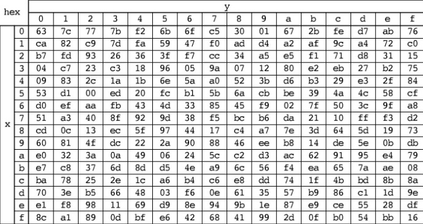 

**ShiftRows**

ShiftRows describes row operations in a matrix. In this step, each row is cyclic shifted to the left by a certain offset. In AES (block size 128 bits), the first row remains the same, and each byte in the second row is cyclic moved one grid to the left. Similarly, the third and fourth rows are cyclic shifted to the left by 2 and 3, respectively. After ShiftRows, each vertical column in the matrix consists of elements from each different column in the input matrix.

**Column Transform (MixColumns)**

In the MixColumns step, the four bytes of each column are combined by a linear transformation. The four elements of each column are treated as coefficients, and the combination is a polynomial in GF (28). Then the polynomial is multiplied with a fixed polynomial under modulo. This step can also be regarded as matrix multiplication under Rijndael finite fields. The MixColumns Function accepts 4 bytes of input and outputs 4 bytes. Each input byte affects the output four bytes. Therefore, the two steps of ShiftRows and MixColumns provide diffusion for this cryptosystem.

**Extended Key (AddRoundKey)**

The AES Algorithm uses the external input key K (the number of words in the keystring is Nk) to obtain a total of 4 (Nr + 1) words of the extended key through the key extension program. It involves the following three modules:

(1) rotword - changing a 4-byte sequence [A, B, C, D] into [B, C, D, A];

(2) S-box transformation (subword) - a 4-byte S-box instead;

(3) Transform Rcon [i] - Rcon [i] represents the 32-bit bit word [xi-1,00,00,00]. Here x is (02), such as Rcon [1] = [01000000]; Rcon [2] = [02000000]; Rcon [3] = [04000000]...

Extension key generation: The first Nk words of the extension key are the external key K; the following words W [[i]] are equal to the "exclusive OR" of its previous word W [[i-1]] and the first Nk words W [[i-Nk]], that is, W [[i]] = W [[i-1]] W [[i-Nk]]. But if i is a multiple of Nk, then W [i] = W [i-Nk] Subword (Rotword (W [[[i-1]])) Rcon [i/Nk].

####  AES Algorithm Implementation

We encapsulate the AES Algorithm into a class in the form of a class, so that it is easy to call its encryption and decryption Algorithm to realize the encryption and decryption operations for files.

1.9.2.1 data members

The data member consists of three parts: S_Box, used as the S-box used for encryption, Inv_S_Box, used as the inverse S-box, that is, the replacement box corresponding to the decryption period, and Rcon, round constant, used in key expansion.

Byte S_Box [16] [16] = {...}; Byte Inv_S_Box [16] [16] = {...};//round constant (AES-128 only takes 10 rounds) word Rcon [10] = {...};

####  Function member

Function members mainly contain the details of AES operations, call methods, etc., the outermost encapsulated'void AES_decrypt (Byte * plain, Byte * key) 'Function and'void AES_encrypt (Byte * plain, Byte * key) ' Function, as the top-level encryption and decryption Function.

Among them, the column mixing and inverse operations in'void MixColumns (Byte mtx [4 * 4]) 'are implemented by a fast Algorithm. GFMul is a multiplication operation on a finite field. For other Algorithm details, please refer to the appendix.

```C++
class AES {
private:
...
public:
        void decrypt(Byte in[4 * 4], word w[4 * (Nr + 1)]);
        void encrypt(Byte in[4 * 4], word w[4 * (Nr + 1)]);
        void KeyExpansion(Byte key[4 * Nk], word w[4 * (Nr + 1)]);
        word SubWord(word sw);
        word RotWord(word& rw);
        word Word(Byte& k1, Byte& k2, Byte& k3, Byte& k4);
        void InvMixColumns(Byte mtx[4 * 4]);
        void InvShiftRows(Byte mtx[4 * 4]);
        void InvSubBytes(Byte mtx[4 * 4]);
        void AddRoundKey(Byte mtx[4 * 4], word k[4]);
        void MixColumns(Byte mtx[4 * 4]);
        Byte GFMul(Byte a, Byte b);
        void ShiftRows(Byte mtx[4 * 4]);
        void SubBytes(Byte mtx[4 * 4]);
        void AES_decrypt(Byte* plain, Byte* key);
        void AES_encrypt(Byte* plain, Byte* key);
};
```


### AES- CBC model encrypted files

####  CBC model principle

#####  Concept analysis

The full name of the CBC model is Cipher Block Chaining, which is called because ciphertext groups are connected to each other like chains.

In the CBC model, the Plain Text group is first XOR with the previous ciphertext group, and then encrypted.

CBC model encryption and decryption process is as follows:

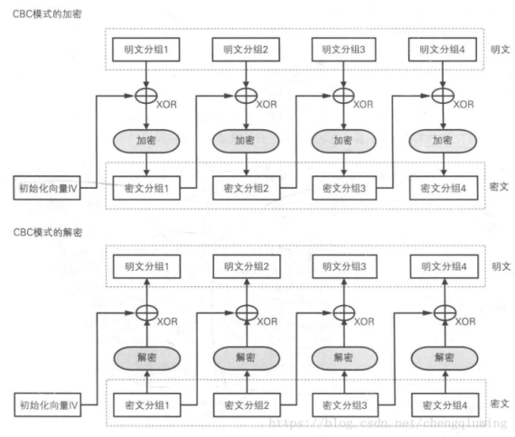 

#####  Initialization vector

When encrypting the first Plain Text packet, since there is no "previous ciphertext packet", it is necessary to prepare a bit sequence of length for one packet in advance to replace the "previous ciphertext packet", this bit sequence is called Initialization Vector, usually abbreviated as IV. Generally speaking, a different bit sequence is randomly generated each time encryption is used as an initialization vector.

Features of the CBC model

Plain Text packets are always XOR with the "previous ciphertext packet" before encryption, so even if the values of Plain Text packet 1 and Plain Text packet 2 are equal, the values of ciphertext packets 1 and 2 are not necessarily equal. In this way, the defect of ECB mode does not exist in the CBC model.

Encryption process: In the CBC model, it is not possible to encrypt an intermediate Plain Text group alone. For example, if you want to generate ciphertext group 3, you need to gather at least Plain Text groups 1, 2, and 3.

Decryption process: Suppose one of the ciphertext packets encrypted by the CBC model is corrupted. In this case, as long as the length of the ciphertext packet does not change, at most 2 packets will be affected by data corruption during decryption. See the figure below:

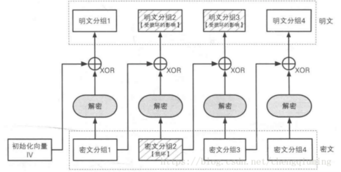 

####  AES- CBC model implementation

We encapsulate AES_FILE class to achieve the use of AES file operations. For AES file operations, we read the file through fstream Header File and encrypt the file using the CBC model.

#####  data member

MAX_LEN: define the file length; PLAIN_LEN: define the size of the Plain Text packet required for each processing; bplain array is used to store the Plain Text content below the packet; key stores the temporary session key; IV stores the initial vector.

#####  Function member

Void encode_file (): AES-CBC model to encrypt the file; decode_file (): AES-CBC model to decrypt the file; void store_file (string name, bool type) to store the encrypted or decrypted file; void read_file (string name, bool type): read the file to be encrypted or decrypted and convert it into the file format required by the AES-CBC model; void set_temp_key (string Key16): assign a randomly generated session key.

The definition of the specific class and the class member Function are defined as follows, and the specific Function content and analysis are shown in the appendix.

class AES_FILE {private:        static const int MAX_LEN = 5000;        static const int PLAIN_LEN = 16;        int data_len;        Byte** bplain,**bplain_copy;        Byte key[16];        char byte_to_char(Byte a);        Byte* IV;public:        void set_temp_key(string Key16);        void read_file(string name, bool type);        void encode_file();        void decode_file();        void store_file(string name, bool type);        void CBC_xor(int index);        void CBC_shapeIV(Byte** IV_data, int index);        void CBC_copyBplain(int index);};

 

## RSA module design

The RSA Algorithm

####  Algorithm Overview

RSA Algorithm is the most widely used public key cryptography algorithm today, and it is also known as the most secure encryption algorithm on earth. According to the use of the key, the password can be divided into symmetric cryptography and public key cryptography:

Symmetric cipher: A way of encrypting and decrypting using the same key

Public key ciphers: The way encryption and decryption use different ciphers, so public key ciphers are often also called asymmetric ciphers.

####  Algorithm description

1. RSA encryption process

RSA encryption process can be expressed using a general formula
$$
Ciphertext = plaintext\ E\ mod\ N
$$


That is RSA encryption is the process of dividing the E power of Plain Text by N and finding the remainder.

From the general formula, as long as you know $E $and $N $, anyone can RSA encryption, so $E, N $is RSA encryption key, that is, the combination of $E $and $N $is the public key, we use $ (E, N) $to represent the public key

Public key = (E, N)

However, $E $and $N $are not just any numbers. They are all calculated by strict mathematics. What requirements and properties $E $and $N $have will be discussed later. By the way, E is the first letter of encryption (Encryption), and N is the first letter of number (Number)

2. RSA decryption process

The decryption of $RSA $can also be expressed using a general formula
$$
Plaintext = ciphertext\ D\ mod\ N
$$
That is to say, the remainder of the ciphertext divided by N after the D power is Plain Text, which is RSA decryption process. Knowing D and N can decrypt the ciphertext, so the combination of D and N is the private key

$$
Private Key = (D,N)
$$
It can be seen from the above RSA encryption and decryption are the same, encryption is "mod N to the power of E"; decryption is "mod N to the power of D." Here D is the first letter of decryption; N is the first letter of number (Number).

3. Generate a key pair

Since the public key is (E, N) and the private key is (D, N), the key pair is (E, D, N) but how is the key pair generated? The steps are as follows:

Find N; find L (L is the middle number of the intermediate process); find E; find D

(1) Find N

Prepare two prime numbers p and q. these two numbers cannot be too small, too small will be easy to crack, multiply p by 1

Get N.

(2) Ask L

L is the least common multiple of p-1 and q-1 and can be represented by the following expression
$$
L = lcm(p-1,q-1)
$$
(3) Ask E

E must satisfy two conditions: E is a number greater than 1 and smaller than L, and the greatest common divisor of E and L is 1

Use gcd (X, Y) to represent X, and the greatest common divisor of Y is the E condition as follows:
$$
1<E<L,\ gcd(E,L)=1
$$
The greatest common divisor of E and L is required to be 1 in order to guarantee that there must be a number D to decrypt. Now that we have found E and N, we have generated the public key in the key pair.

(4) Ask D

The number D is calculated from the number E. The following relationship must be satisfied between D, E and L:
$$
1<D<L,D\times L=1
$$
As long as D satisfies the above two conditions, the ciphertext encrypted by E and N can be decrypted with D and N.

### RSA Algorithm implementation

RSA Algorithm is the top-level and core Algorithm of this project. As a linking program for other projects, it has the most interfaces and is more complicated to implement. It can be mainly divided into three sections: random key generation, RSA encryption section, RSA decryption section.

```C++
class RSA_key {
private:
    ZZ p;
    ZZ q;
    ZZ euler;
ZZ n;
ZZ e;//encryption key
ZZ d;//decryption key
    string str1;
//key 1 hexadecimal
    string str2 ;
//key 2 hexadecimal
    string s ;
//Initial value of Random Seed
    void Selection(ZZ& e, ZZ euler);
    void SaveKey(const ZZ e, const ZZ d, const ZZ n);
    void KeyGeneration(ZZ& d, ZZ& e, const ZZ euler);
public:
    void getPublicKey(RSA_key giver);
    ZZ MyRandomPrime(int bitnum, bool prime_flag);
    ZZ string16_to_ZZ(string str);
    void key_create(bool mode, int bitnum);
    void Encryption(string file_in, string file_out);
    void Decryption(string file_in, string file_out);
    string ZZ_to_string16(ZZ a);
    void readPublicKey();
    void readPrivateKey();
};
```


#####  Random key generation

Since random key generation requires a random key with implementation lengths of 512 bits and 1024 bits, we need to implement RandomPrime Function, call ANSI X9.17 Algorithm and Miller's primacy detection Algorithm to jointly generate the random key q, p. At the same time, Selection Algorithm calls ANSI X9.17 Algorithm to generate the random number e encryption key, and uses Euclidean Algorithm to ensure that the result of e is coprime with euler, so as to ensure the reliability of the generated key.

Functions specifically involved include the following:

```C++
Void Selection (ZZ & e, ZZ euler);//The result of generating e is prime of the euler
    void SaveKey(const ZZ e, const ZZ d, const ZZ n);//保存密钥
    void KeyGeneration(ZZ& d, ZZ& e, const ZZ euler);//生成密钥d和e
ZZ MyRandomPrime (int bitnum, bool prime_flag);
ZZ string16_to_ZZ (string str);//hexadecimal to ZZ Function
Void key_create (bool mode, int bitnum);
String ZZ_to_string16 (ZZ a);//ZZ to hexadecimal Function
```

####  RSA encryption algorithm implementation

RSA encryption algorithm is for the temporary session key encryption. At the same time, before encrypting, we need to read the encryption key (public key) through the file operation to encrypt. For the encryption result of the temporary session key, we store it as c1, use the temporary session key, call AES-CBC Algorithm encryption to encrypt the file, the encrypted result is stored in c2, c1, c2 are stored as files, and provided to the decryption operation for decryption.

The specifically designed Functions include the following:

```C++
    void SaveKey(const ZZ e, const ZZ d, const ZZ n);
    void Encryption(string file_in, string file_out);
    string ZZ_to_string16(ZZ a);
    void readPublicKey(); 
```

####  RSA Decryption Algorithm Implementation

Similar to an encryption algorithm. RSA decryption algorithm first needs to read the corresponding private key, encrypted file c1, encrypted file c2, decrypt the encrypted file c1 with the private key to obtain our temporary session key, and then use the temporary session key as the decryption key of the AES algorithm to decrypt file c2 to obtain our Plain Text m, and finally output the obtained Plain Text m to the file. So far, the entire RSA-key generation, encryption, and decryption algorithm is finished.

The RSA related functions are as follows:

```C++
    void SaveKey(const ZZ e, const ZZ d, const ZZ n);
    void Decryption(string file_in, string file_out);
    void readPrivateKey();
```

# Chapter 3, Experimental Design and Program Run Instructions

## Experimental Design Description

We can roughly simulate the operation idea of the entire program, but in order to better fit the real situation, there are three different steps:

1. Alice generates a random key and transmits the public key to Bob at the same time

2. Bob gets the public key, generates a random session key for file encryption, and transmits the ciphertext (c1, c2) to Alice

3. Alice obtains the private key generated by herself, and decrypts the file to obtain Plain Text.

Among them, Bob and Alice are two independent individuals, how can they reflect the "independence" of their respective information and the independence of encryption and decryption?

### Instantiate two different classes on Bob and Alice respectively

We exemplify Alice and Bob as two classes respectively:

`RSA_key ALICE_privateRSA`

`RSA_key BOB_publicRSA`

For Alice and Bob can not share the public and private keys, Bob can only get RSA Public_Key in key generation, Alice can only get RSA key generation Private_Key, more in line with the real situation of the encryption and decryption process, to ensure the independence of information.

### The program runs in three different stages

We "interrupt" the whole program into three different stages - Alice generates random key; Bob obtains public key encryption; Alice obtains private key decryption. Each stage chooses to terminate the program immediately after execution, which can effectively eliminate the intermediate variables after running the program. The encrypted and decrypted information can only be obtained by reading the file, which simulates the characteristics of file transmission and is more in line with the independence of the encryption and decryption process.

## Program running instructions

####  Random key generation section

First, after entering, you need to select the program mode. Before encryption, please select 1 to generate RSA public and private keys

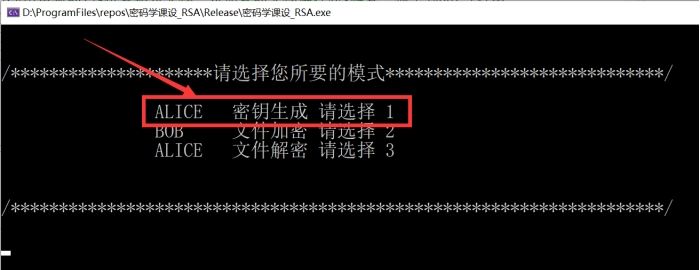 

2. Enter 1 in the cmd window, and then the length of the key to be generated will be displayed, 512bit and 1024bit, choose according to the requirements:

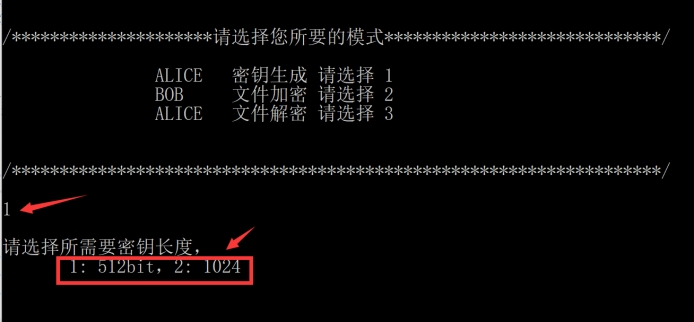 

3, after selecting the key length, the program automatically executes RSA key generation process

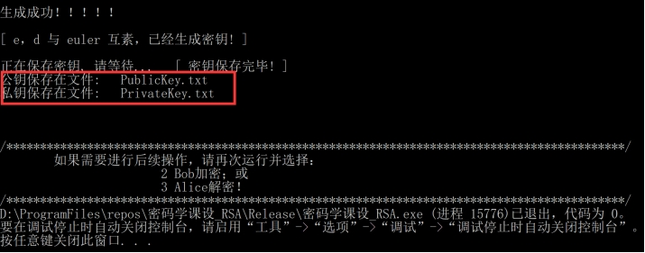 

4. After the generation is successful, it is prompted to store the public key in the PublicKey.txt and the private key in the PrivateKey.txt for use in the next stage. At the same time, you can close the program to complete all the processes of RSA key generation.

####  Bob RSA encryption

5. After entering again, you need to select the program mode, select 2: Bob encryption mode

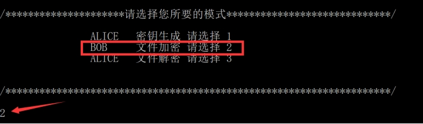 

6, the encryption part of the RSA will be carried out during the period, and the encryption process will be displayed in the cmd window, including:

(1) Random session key generation process

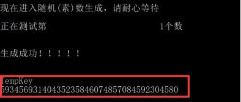 

(2) Reading files and encryption process

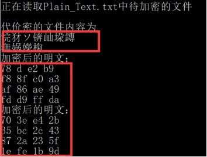 

(3) AES encryption result of the file

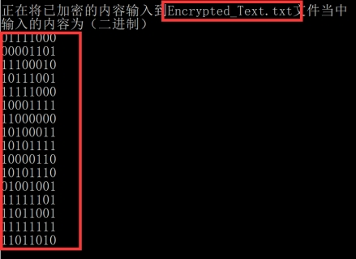 

(4) Encryption and storage of session keys

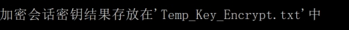 

####  Alice RSA decryption section

7. After re-entering, you need to select the program mode, select 3: Alice decryption mode

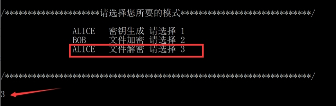 

8. In this mode, the reading and decryption process of the ciphertext c1 and c2 files will be automatically performed. Similar to the encryption process, the temporary session key, the original information of the ciphertext and the decryption information will be displayed.

(1) Decryption of the temporary key

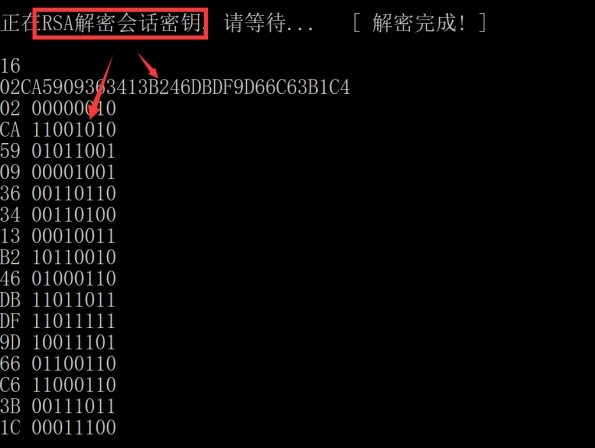 

(2) Decryption of ciphertext

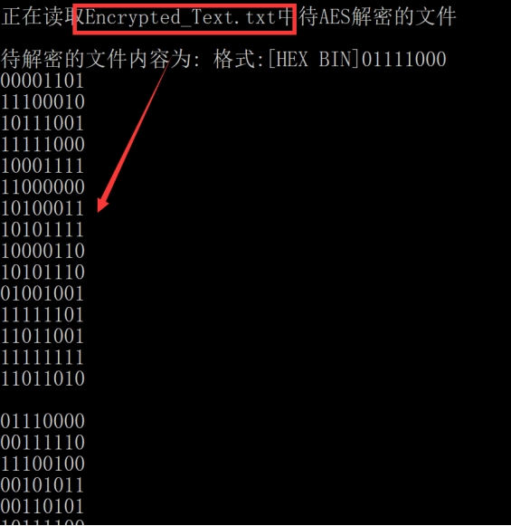 

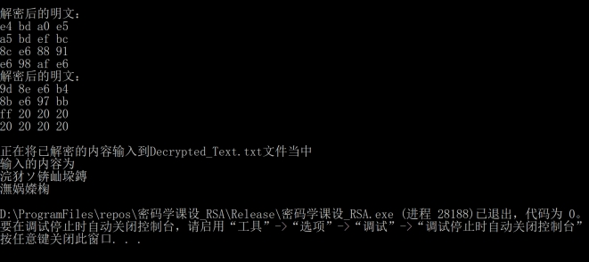 

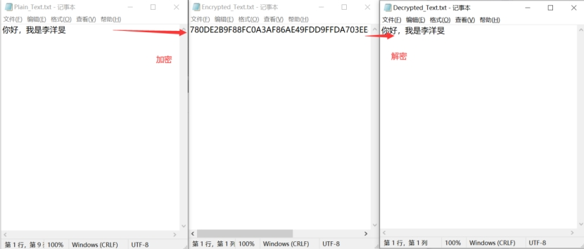 

9. During the execution of the program, the temporary session key, the Plain Text and ciphertext information of the file are saved, which is convenient for inspection after the execution is completed.

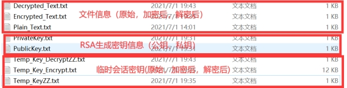 

 