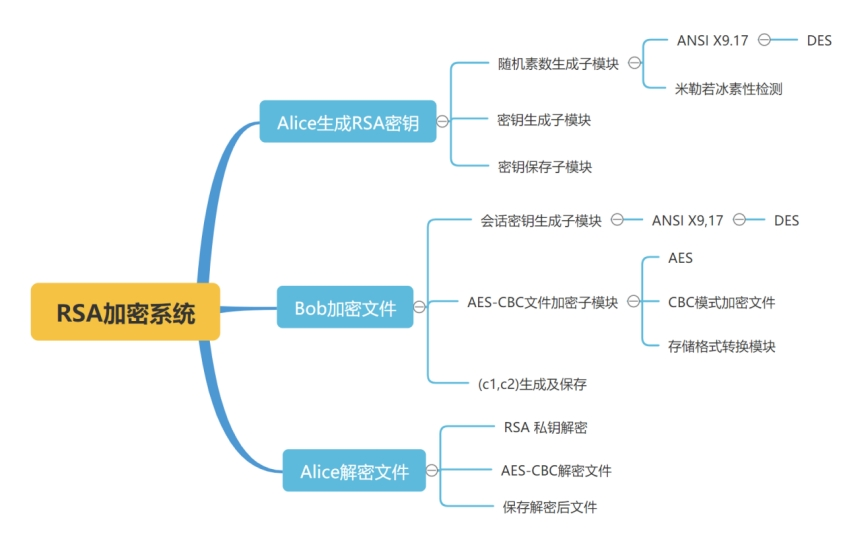
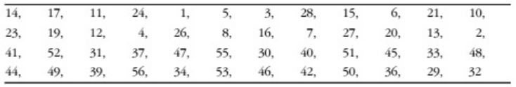
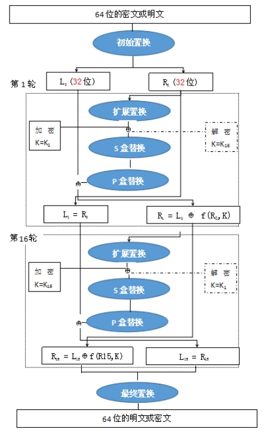
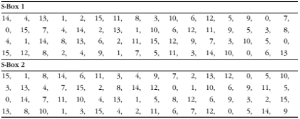
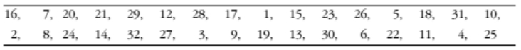
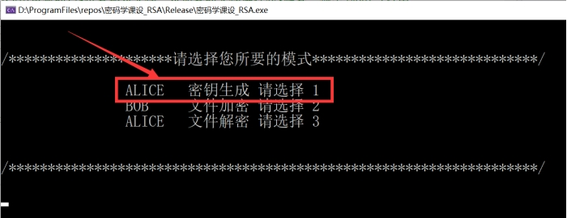
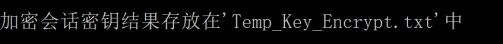
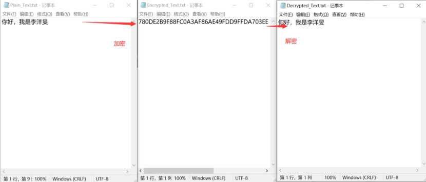

 

 

 

2021现代密码学课程设计任务

摘要

本文针对于2021年现代密码学课程设计内容为主题撰写现代密码学课程实际实验报告，实现的内容主要包括：DES算法设计、AES算法设计、ANSI X9.17算法实现伪随机数比特生成器、米勒若冰素性检测算法、RSA密钥生成、AES-CBC模式加密、解密文件、RSA加密、解密会话密钥等。主要使用C++语言，基于Visual Studio2019进行开发，主要基于NTL库作为附加依赖的静态链接库来实现素性检测、RSA加密解密等相关算法的数据结构和函数基础。

最终实现的结果针对于三个不同编程任务实现了三个不同的板块：分别为ALICE生成RSA密钥板块；BOB加密文件m并发送给ALICE板块；ALICE解密恢复文件m板块。在编程过程中注重细节，密钥的文件存储等。为了不引入中间变量对于结果的影响，由用户自主选择每个板块，每次进行上述一组板块后终止程序，下一次再调用程序进行密钥生成、加密或解密。

关键词 

RSA加密系统，ANSI X9.17，DES，AES-CBC，自主选择

# 第一章 题目背景

## 编程任务及要求

### Alice生成RSA密钥:

#### 描述

Alice生成一对RSA公钥(n, b)和私钥(p, q, a),其中随机素数p, q都为512比特长，或都为1024比特长度:两种长度都需支持。

#### 要求 

基于开源代码NTL实现,NTL为密码界流行的高精度代数数论库。不支持其他方式。NTL网址: https://www.shoup.net/ntl/。网站上或下载下来的文档中有详细的使用说明书。

注意：为了保证通过素性检测的数是素数的概率足够大,需测试足够的次数,如产生512比特的素数,通过测试的数不是素数的概率(即错误概率）接近1/2512。

### Bob加密文件m并发给Alice:

#### 描述

1、输入文件为任意长。如何把文件转成所需要的格式,请自行决定。 CBC模式中,如果m的长度不是分组的倍数时,需要填充,如何填充请自 行决定,但解密时需要把填充去掉。

2、生成128比特的随机数 *k* 作为临时的会话密钥。

3、用Alice的公钥加密k得到 `c1 - kb mod n`。

4、用会话密钥k加密文件m得到c2,其中加密算法为AES,使用CBC模式。

5、把 *(c1, c2)* 发给 Alice。

#### 1.2.2 要求 

AES 的列混合运算及其逆运算使用我的课件中提供的快速算法。S-Box 使用查表方式实现。AES的测试数据可参考AES 的flash动画。

### 1.3 Alice解密恢复文件m

#### 1.3.1 描述

1、用Alice的RSA私钥解密 $c1$ 得到 $k$。

2、用k解密 $c2$ 得到 $m$。

3、输出 $m$。

## 限制要求

上面所涉及到的随机数(包括随机素数生成,CBC中的IV）请使用ANSI X9.17算法生成,不可使用系统提供的伪随机数函数生成。用于密码用途的随机数需使用专用于密码用途的伪随机数算法生成。

算法ANSI X9.17伪随机数比特生成器

输入：随机（秘密的）64比特种子 $s$，整数$m$，两个DES密钥 $k1, k2$。

输出：$m$个64位的随机比特串$x_1, x_2, ..., x_m$。

1、计算中间值$I=DES_{k1}(DES_k2^{-1}(DES_{k1}(D)))$，其中 $D$ 表示当前日期/时间的精确表示，$DES$ 表示**DES**加密。$DES^{-1}$表示**DES**解密。

2、`For i=1 to m`:
$$
x_i = DES_{k1}(DES_k2^{-1}(DES_{k1}(I\oplus s)))\\
s = DES_{k1}(DES_k2^{-1}(DES_{k1}(x_i\oplus I)))
$$
3、返回$x_1, x_2, ..., x_m$ .

# 第二章 程序设计说明

## 1 程序设计总体架构

### 1.4 RSA加密系统整体框架

 

程序的整体构建如上图所示。主要包括三个大板块的内容：

1、Alice生成RSA密钥

具体涉及随机素数生成、密钥生成、密钥保存三个子模块，其中随机素数生成调用 $ANSI X9.17随机数生成器（内部设计三重DES算法），以及米勒若冰素性检测模块。

2、Bob加密文件

具体涉及临时会话密钥生成子模块（内部包含 ANSI X9.17随机素数生成器），AES-CBC文件加密子模块，以及(c1,c2)密文生成保存子模块，其中AES-CBC文件加密子模块内部包含AES算法，CBC模式加密文件，存储格式转换三个子模块。

3、Alice解密文件

具体涉及RSA私钥解密，AES-CBC模式解密文件，解密后文件保存和输出三个子模块。

### 1.5 程序设计总体框架

在RSA加密系统总体框架中中所叙述的算法描述中，涉及到以下几个核心的部件模块。在此进行整理并作为代码生成的主要构架：

1、DES算法，作为ANSI X9.17随机数生成器的核心

2、ANSI X9.17，调用DES算法达到生成随机数的功能

3、PrimeTest素性检测模块，作为密钥生成的核心保障

4、RSA密钥生成模块，调用上述模块以生成RSA加密、解密密钥

5、AES算法，作为文件加密的基础

6、AES-CBC文件加密/解密，作为文件加密的核心模块

7、RSA加密/解密。利用RSA自身对于会话密钥的加解密的基础调用AES-CBC对于文件的加解密，形成一个版完整体系

8、顶层模块，整合上述所有次顶层模块并实现功能

## 程序设计各模块详细设计说明

### 算法设计

#### 算法原理

DES(Data Encryption Standard)是目前最为流行的加密算法之一。DES是对称的，也就是说它使用同一个密钥来加密和解密数据。

DES还是一种分组加密算法，该算法每次处理固定长度的数据段，称之为分组。DES分组的大小是64位，如果加密的数据长度不是64位的倍数，可以按照某种具体的规则来填充位。

从本质上来说，DES的安全性依赖于虚假表象，从密码学的术语来讲就是依赖于“混乱和扩散”的原则。混乱的目的是为隐藏任何明文同密文、或者密钥之间的关系，而扩散的目的是使明文中的有效位和密钥一起组成尽可能多的密文。两者结合到一起就使得安全性变得相对较高。

DES算法具体通过对明文进行一系列的排列和替换操作来将其加密。过程的关键就是从给定的初始密钥中得到16个子密钥的函数。要加密一组明文，每个子密钥按照顺序（1-16）以一系列的位操作施加于数据上，每个子密钥一次，一共重复16次。每一次迭代称之为一轮。要对密文进行解密可以采用同样的步骤，只是子密钥是按照逆向的顺序（16-1）对密文进行处理。

##### 计算16个子密钥

上面提到DES算法的第一步就是从初始密钥中计算得出16个子密钥。图示展示了这个过程。DES使用一个56位的初始密钥，但是这里提供的是一个64位的值，这是因为在硬件实现中每8位可以用于奇偶校验，在软件实现中多出的位只是简单的忽略掉。要获得一个56位的密钥，可以执照表1的方式执行密钥转换。解释一下表1，按照从左往右从上往下的方式看，表格中每个位置P包含初始密钥中位在转换后的密钥中所占的位置。比如，初始密钥中的第57位就是转换后的密钥中的第1位，而初始密钥中的第49位则变成转换后的密钥中的第2位，以此类推...。（数据位的计数顺序按照从左到右从1开始的）

 

图 2 DES中密钥的转换表（DesTransform[56]）

将密钥转换为56位后，接下来计算子密钥。首先，将56位的密钥分为两个28位的组。然后，针对每个子密钥，根据子密钥的序列值（也就是16个子密钥中的第几个）旋转这两组值（旋转的位数见表2），然后重新合并。之后，再按照表3所示对重组后的密钥进行置换，使56位的子密钥缩小为48位（注意表3只有48位，丢弃了8位）。这个排列过程就称为置换选择。

针对16个子密钥，每个子密钥重复一次该过程。这里的目的是保证将初始密钥中的不同位在每一轮排列后应用于加密的数据上。

 

 

 

 

##### 加密和解密数据块

经过上述过程，我们已经准备好了子密钥。接着就可以加密和解密数据块了。图2展示了这个过程。

 

上图所示的方式置换64位的数据块开始，该置换过程称为初始置换。该过程并不会增加DES的安全性，但这种做法在16位和32位的总线出现之前将使得数据更容易加载到DES芯片中。虽然这种处理已经不合时宜，但该置换过程仍然保留以满足DES标准。

 

经过初始置换后，64位的数据块分为两个32位的组，L0和R0。完成初始置换后，数据块将重复执行16轮一系列的操作。每一轮操作（i）的目的是计算出Li和Ri ，这些结果将用在下一轮操作中直到最终得到数据 $R16$ 和 $L16$。

每一轮以 $Li-1$和$Ri-1$开始，然后根据表所示进行扩展置换，将$R_{i-1}$从 32 位扩展到 48 位。该置换的主要目的是在加密数据的过程中制造一些雪崩效应，使用数据块中的 1位 将在下一步操作中影响更多位，从而产生扩散效果。

一旦扩展置换完成，计算出48位的结果值与这一轮子密钥$K_i$  的异或值（**XOR**，符号计为⊕)。这将产生48位的中间值，记为$R_{int}$。

如果将E计为扩展置换的结果，则本轮到目前为止的操作可以表示为：

$$R_{int} = E（Ri-1) ⊕ Ki$$

 

下一步，$R_{int}$需要通过8个单独的S盒执行8次替换操作。每个S盒（j）从$R_{int}$的$6j$ 到 $6j+6$ 的位置取出6位，并为其在表中查出1个4位的值，将该值写到缓冲区的$4j$位置处。

 

 

 

一旦完成了S盒替换，得到的结果又变为一个32位的值。接下来再通过P盒来置换。如下表所示。

 

到目前为止，我们把这一轮的操作想象为一个函数，一般记为f。如果 $b_j$ 代表$R_int$中的第$j$个6位组，$S_j$ 代表第 j 个 S 盒，而 P 代表 P 盒置换，则该函数可以定义为：
$$
f = P(S1(b1),S2(b2),...,S8(b8))
$$
每一轮的最后一个操作是计算 f 的32位结果值与传入本轮操作的原始数据的左分组Li-1之间的异或值。

一旦完成，将左右两个分组交换然后开始下一轮。在最后一轮中，不用交换左右分组。

把所有的步骤连起来，在每一轮中计算$Li$和$Ri$的步骤可以精确表示为：
$$
L_i = R_i - 1\\
R_i = (L_i-1)\oplus F(R_i-1,K_i)\\
L_i = R_i -1
$$
当全部的16轮操作都结束后，将最后的右分组$R16$和最后剩下的左分组$L16$连接起来，组成一个64位的分组$R16-L16$。

最后一步是将R16-L16进行置换。简而言之，撤消之前的初始置换。加密数据时，最终结果就是一个64位的密文，而当解密数据时，最终结果就是64位的明文了。

 

#### DES算法实现

通过建立DES类来封装相应数据成员和函数成员，以及外部实现和调用的接口。

##### 数据成员

数据成员主要包括初始置换表、密钥初始置换表、密钥循环移位数表、密钥压缩置换表、数据扩展表、s盒置换表、最终置换表。共8个表格以及给到DES加密的初始密钥。具体信息定义如下：

```C++
class DES {
private:
    /***数据初始置换表***/
    int T1[8][8];
    /***密钥初始置换表***/
    int T2[8][7];
    /***密钥循环左移位数表***/
    int T3[16];
    /***密钥压缩置换表***/ 
    int T4[8][6];
    /***数据扩展表***/ 
    int T5[8][6];
    /***S盒置换表***/ 
    int S[8][4][16];
    /***P盒置换表***/
    int P[4][8];
    /***最终置换表***/
    int T6[8][8];
    string Keys[20];
public:
...
};
```

##### 函数成员

主要包括封装实现DES算法的各个函数，通过string类来完成实现，具体的函数定义如下，具体的函数实现及每个函数的具体解析参考附录。

```C++
class DES {
private:
...
public:   
   string DES_encrypt(string P, string K);
    string DES_decrypt(string C, string K);
    void generateKeys(string s);
    string decrypt(string str);
    string encrypt(string str1);
    string f(string str1, string str2);
    string G(string str);
    string H(string s);
    string plaintext_initial_permutation(string s);
    string secret_key_initial_permutation(string s);
    string secret_ket_left_move(int k, string s);
    string secret_key_compression_replacement(string s);
    string plaintext_righthalf_extended_permutation(string s);
    string XOR(string s1, string s2);
    string S_box(string s);
    string P_box(string s);
    string final_permutation(string s);
};
```


### ANSI X9.17模块算法设计

#### ANSI X9.17算法原理

##### 算法背景

$ANSI X9.17$标准是美国国家标准化协会制订的金融机构密钥管理规范；$ANSI$（美国国家标准化协会）负责金融安全的小组是$ASC X9$和$ASC X12$。其中$ASC X9$负责制定金融业务标准，$ASC X12$负责制定商业交易标准。其中$ANSI X9.17$标准制定于1985年，对金融机构的密钥管理进行了规范。

在多数情况下，我们都是使用某种特定的密码算法来辅助完成随机数的产生，$ANSI X9.17$也不例外，它的算法就是基于大名鼎鼎的DES（数据加密标准）。

数据加密标准（Data Encryption Standard，DES）是迄今世界上最为广泛使用和流行的一种分组密码算法，它的分组长度为64比特，密钥长度为56比特，它是由美国IBM公司研制的，源于早期的一种被称为Lucifer密码的发展和修改。

DES是一个迭代型的分组密码，使用称为 Feistel 的技术，其中将加密的文本块分成两半。使用子密钥对其中一半应用循环功能，然后将输出与另一半进行“异或”运算；接着交换这两半，这一过程会继续下去，但最后一个循环不交换。DES 使用16个循环。

为了提高安全性，通常人们并不使用单纯的DES，而是将DES算法在多密钥情况下多重使用，例如两个密钥的三重DES。此方案已经被证明了是行之有效的，已在密钥管理标准$ANSI X9.17$和$ISO 8732$中被采用。

#####  算法实现过程

在上图中的EDE表示两个密钥的三重DES算法；产生器主要有3个组成部分。

1) 输入 输入为两个64比特的伪随机数，其中 $DT_i$ 表示当前的日期和时间；每产生一个数 $R_i$ 后，$DT_i$ 都会更新一次；$V_i$ 是产生第 $i$ 个随机数时的种子，其初值可任意设定，以后每次都会自动更新。

2) 密钥 产生器使用了3次三重DES加密，3次加密使用相同的两个56比特密钥 $K1$和$K2$，这两个密钥必须保密且不能用作他用。

3) 输出 输出为一个64比特的伪随机数$R_i$和一个64比特的新种子$V_{i+1}$。

本方案具有很高的密码强度，因为其采用了112比特长的密钥和9个DES加密，同时还由于算法由两个伪随机数输入驱动，一个是当前的日期和时间，另一个算法上次产生的新种子；而且即使某次产生的随机数$R_i$泄漏了，但由于$R_i$又经一次$EDE$加密后才产生新种子$V_{i+1}$，因此即使别人得到$Ri$也得不到$V_{i+1}$，从而得不到新随机数$R_{i+1}$。

##### 算法性描述

输入：随机（秘密的）64比特种子$s$，整数$m$，两个DES密钥$k_1,k_2$。

输出：m个64位的随机比特$x_1,x_2,...,x_m$

1、计算中间值$I=DES_{k1}(DES_k2^{-1}(DES_{k1}(D)))$，其中 $D$ 表示当前日期/时间的精确表示，$DES$ 表示**DES**加密。$DES^{-1}$表示**DES**解密。

2、`For i=1 to m`:
$$
x_i = DES_{k1}(DES_k2^{-1}(DES_{k1}(I\oplus s)))\\
s = DES_{k1}(DES_k2^{-1}(DES_{k1}(x_i\oplus I)))
$$
3、返回$x_1, x_2, ..., x_m$ .

#### ANSI X9.17算法实现

ANSI X9.17算法的作用是生成随机数，在后续的AES随机密钥生成，RSA中p，q的生成等多出需要用到，为此我们同样将其封装为类，供后续使用，由于继承自DES类，只包括三个类成员函数。分别的作用是：

##### string threeDES(string a, string key1, string key2, DES des)

实现三重DES算法。

##### string string_to_hex(const string& str)

实现string到hex的转变。

##### Ansi(int m, string key1, string key2, string s, char** result)

调用三重DES算法的顶层模块。其中涉及到如下的类及类成员函数。具体的详细代码参考附录。

```C++
class ANSI {
private:
    string threeDES(string a, string key1, string key2, DES des);
public:
    void Ansi(int m, string key1, string key2, string s, char** result);
    string string_to_hex(const string& str);
};
```

### PrimeTest素性检测算法设计

#### 米勒若冰素性检测算法原理

#####  结论

Miller-Rabin 算法可以在 $O(klog2(n)) $的时间内检测一个超级大的正整数 n 是否是素数，k 为自己设定的检测的次数。裸的 Miller-Rabin 算法在验证一个数是否为素数时出错的可能性随着测试次数的增加而降低 (不可能降为 0)

Miller-Rabin 是随机算法，得到的结果的正确率为 75%, 所以应该多次调用该函数，使正确概率提高为 $1 − (1/4)^k$。

#### 米勒若冰素性检测算法实现

由于素性检测算法同样也较多的用于其他模块，作为基本模块同样将其用一个Prime 类进行封装。具体包括两个函数

1、`long witness(const ZZ& n, const ZZ& x)`作为素性检测的每一轮的基本素性检测函数。

2、`long PrimeTest(const ZZ& n, long t)`作为素性检测的顶层函数，调用witness函数进行每一轮测试的实现。

如下为封装好的素性检测Prime类及类成员函数，具体的详细代码参考附录。

```C++
class Prime {
private:
    long witness(const ZZ& n, const ZZ& x);
public:
    long PrimeTest(const ZZ& n, long t);
};
```

### AES算法设计

#### AES算法原理

##### 算法概述

美国国家标准与技术研究所(NIST)在2002年5月26日建立了新的高级数据加密标准(AES)规范。本文中我将提供一个用C#编写的的能运行的 AES 实现，并详细解释到底什么是 AES 以及编码是如何工作的。我将向您展示如何用 AES 加密数据并扩展本文给出的代码来开发一个商业级质量的 AES 类。我 还将解释怎样把 AES 结合到你的软件系统中去和为什么要这么做，以及如何测试基于 AES 的软件。

注意本文提供的代码和基于本文的任何其它的实现都在联邦加密模块出口控制的适用范围之内（详情请参看 Commercial Encryption Export Controls ）。

AES 是一个新的可以用于保护电子数据的加密算法。明确地说，AES 是一个迭代的、对称密钥分组的密码，它可以使用128、192 和 256 位密钥，并且用 128 位（16字节）分组加密和解密数据。与公共密钥密码使用密钥对不同，对称密钥密码使用相同的密钥加密和解密数据。通过分组密码返回的加密数据 的位数与输入数据相同。迭代加密使用一个循环结构，在该循环中重复置换（permutations ）和替换(substitutions）输入数据。Figure 1 显示了 AES 用192位密钥对一个16位字节数据块进行加密和解密的情形。

##### 1.9.1.2 算法描述

AES加密过程是在一个4×4的字节矩阵上运作，这个矩阵又称为“体（state）”，其初值就是一个明文区块（矩阵中一个元素大小就是明文区块中的一个Byte）。（Rijndael加密法因支持更大的区块，其矩阵行数可视情况增加）加密时，各轮AES加密循环（除最后一轮外）均包含4个步骤：

1、AddRoundKey—矩阵中的每一个字节都与该次回合密钥（round key）做XOR运算；每个子密钥由密钥生成方案产生。

2、SubBytes—通过一个非线性的替换函数，用查找表的方式把每个字节替换成对应的字节。

3、ShiftRows—将矩阵中的每个横列进行循环式移位。

4、MixColumns—为了充分混合矩阵中各个直行的操作。这个步骤使用线性转换来混合每内联的四个字节。最后一个加密循环中省略MixColumns步骤，而以另一个AddRoundKey替换。

**S盒变换（SubBytes）**

矩阵中的各字节通过一个8位的S-box进行转换。这个步骤提供了加密法非线性的变换能力。S-box与GF（28）上的乘法反元素有关，已知具有良好的非线性特性。为了避免简单代数性质的攻击，S-box结合了乘法反元素及一个可逆的仿射变换矩阵建构而成。此外在建构S-box时，刻意避开了固定点与反固定点，即以S-box替换字节的结果会相当于错排的结果。AES算法中的S盒如图2.2所示例如一个字节为0x19，经过S盒变换查找n(1,9) = 0xd4,所以就替换为0xd4。

 

**行变换 （ShiftRows）**

ShiftRows描述矩阵的行操作。在此步骤中，每一行都向左循环位移某偏移量。在AES中（区块大小128位），第一行维持不变，第二行里的每个字节都向左循环移动一格。同理，第三行及第四行向左循环位移的偏移量就分别是2和3。经过ShiftRows之后，矩阵中每一竖列，都是由输入矩阵中的每个不同列中的元素组成。

**列变换 （MixColumns）**

在MixColumns步骤，每一列的四个字节通过线性变换互相结合。每一列的四个元素分别当作系数，合并即为GF（28）中的一个多项式，接着将此多项式和一个固定的多项式在modulo 下相乘。此步骤亦可视为Rijndael有限域之下的矩阵乘法。MixColumns函数接受4个字节的输入，输出4个字节，每一个输入的字节都会对输出的四个字节造成影响。因此ShiftRows和MixColumns两步骤为这个密码系统提供了扩散性。

**扩展密钥（AddRoundKey）**

AES算法利用外部输入密钥K(密钥串的字数为Nk),通过密钥的扩展程序得到共计4(Nr+1)字的扩展密钥。它涉及如下三个模块:

(1) 位置变换(rotword)——把一个4字节的序列[A,B,C,D]变化成[B,C,D,A]；

(2) S盒变换(subword)——对一个4字节进行S盒代替；

(3) 变换Rcon[i]——Rcon[i]表示32位比特字[xi-1,00,00,00]。这里的x是(02)，如 Rcon[1]=[01000000]；Rcon[2]=[02000000]；Rcon[3]=[04000000]…… 　　

扩展密钥的生成：扩展密钥的前Nk个字就是外部密钥K；以后的字W[[ｉ]]等于它前一个字W[[i-1]]与前第Nk个字W[[i-Nk]]的“异或”,即W[[i]]=W[[i-1]]W[[i-Nk]]。但是若ｉ为Nk的倍数，则W[i]=W[i-Nk]Subword(Rotword(W[[i-1]]))Rcon[i/Nk]。

#### 1.9.2 AES算法实现

我们采用类的形式将AES算法封装成类，从而容易调用其加密解密算法实现对于文件的加密和解密操作。

##### 1.9.2.1 数据成员

数据成员包括三个部分：S_Box，作为加密所用的S型盒所使用。Inv_S_Box，作为逆S型盒子，即解密时期所对应的替换盒的使用。以及Rcon，轮常数，密钥扩展中用到。

Byte S_Box[16][16] = {...};	Byte Inv_S_Box[16][16] = {...};	// 轮常数（AES-128只需要10轮）	word Rcon[10] = {...};

##### 1.9.2.2 函数成员

函数成员主要包含对于AES运算的详细细节，调用方式等等，最外层所封装的`void AES_decrypt(Byte* plain, Byte* key)`函数和`void AES_encrypt(Byte* plain, Byte* key)`函数，作为最顶层的加密和解密函数。

其中`void MixColumns(Byte mtx[4 * 4])`中列混合和逆运算采用快速算法进行实现。GFMul，为有限域上的乘法运算。其余算法细节请参考附录。

```C++
class AES {
private:
...
public:
	void decrypt(Byte in[4 * 4], word w[4 * (Nr + 1)]);
	void encrypt(Byte in[4 * 4], word w[4 * (Nr + 1)]);
	void KeyExpansion(Byte key[4 * Nk], word w[4 * (Nr + 1)]);
	word SubWord(word sw);
	word RotWord(word& rw);
	word Word(Byte& k1, Byte& k2, Byte& k3, Byte& k4);
	void InvMixColumns(Byte mtx[4 * 4]);
	void InvShiftRows(Byte mtx[4 * 4]);
	void InvSubBytes(Byte mtx[4 * 4]);
	void AddRoundKey(Byte mtx[4 * 4], word k[4]);
	void MixColumns(Byte mtx[4 * 4]);
	Byte GFMul(Byte a, Byte b);
	void ShiftRows(Byte mtx[4 * 4]);
	void SubBytes(Byte mtx[4 * 4]);
	void AES_decrypt(Byte* plain, Byte* key);
	void AES_encrypt(Byte* plain, Byte* key);
};
```


### AES-CBC模式加密文件

#### CBC模式原理

##### 概念解析

CBC模式的全称是Cipher Block Chaining模式（密文分组链接模式），之所以叫这个名字，是因为密文分组像链条一样相互连接在一起。

在CBC模式中，首先将明文分组与前一个密文分组进行XOR运算，然后再进行加密。

CBC模式加解密过程如下：

 

##### 初始化向量

当加密第一个明文分组时，由于不存在“前一个密文分组”，因此需要事先准备一个长度为一个分组的比特序列来代替“前一个密文分组”，这个比特序列称为初始化向量（Initialization Vector），通常缩写为IV，一般来说，每次加密时都会随机产生一个不同的比特序列来作为初始化向量。

##### CBC模式的特点

明文分组在加密之前一定会与“前一个密文分组”进行XOR运算，因此即使明文分组1和明文分组2的值是相等的，密文分组1和2的值也不一定是相等的。这样一来，ECB模式的缺陷在CBC模式中就不存在了。

加密过程：在CBC模式中，无法单独对一个中间的明文分组进行加密。例如，如果要生成密文分组3，则至少需要凑齐明文分组1、2、3才行。

解密过程：假设CBC模式加密的密文分组中有一个分组损坏了。在这种情况下，只要密文分组的长度没有发生变化，则解密时最多只有2个分组受到数据损坏的影响。见下图：

 

#### AES-CBC模式实现

我们通过封装AES_FILE类来达成对于AES文件操作的使用。对于AES的文件操作而言，我们通过fstream头文件对于文件进行读取处理，采用CBC模式对于文件进行加密。

##### 数据成员

MAX_LEN：定义文件长度；PLAIN_LEN：定义每次处理所需要用到的明文分组的大小；bplain数组用来储存该分组下面的明文内容；key存储临时会话密钥；IV存储初始向量。

##### 函数成员

void encode_file()：AES-CBC模式加密文件；decode_file()：AES-CBC模式解密文件；void store_file(string name, bool type) 将加密或解密后的文件存储；void read_file(string name, bool type)：读取待加密或待解密的文件，转换成AES-CBC模式所需要的文件格式；void set_temp_key(string Key16)：将随机生成的会话密钥予以赋值。

具体的类的定义和类成员函数定义如下，具体函数内容和解析见附录。

class AES_FILE {private:	static const int MAX_LEN = 5000;	static const int PLAIN_LEN = 16;	int data_len;	Byte** bplain,**bplain_copy;	Byte key[16];	char byte_to_char(Byte a);	Byte* IV;public:	void set_temp_key(string Key16);	void read_file(string name, bool type);	void encode_file();	void decode_file();	void store_file(string name, bool type);	void CBC_xor(int index);	void CBC_shapeIV(Byte** IV_data, int index);	void CBC_copyBplain(int index);};

 

### RSA模块设计

#### RSA算法原理

##### 算法概述

RSA算法是现今使用最广泛的公钥密码算法，也是号称地球上最安全的加密算法。根据密钥的使用方法，可以将密码分为对称密码和公钥密码：

对称密码：加密和解密使用同一种密钥的方式 

公钥密码：加密和解密使用不同的密码的方式，因此公钥密码通常也称为非对称密码。

##### 算法描述

1、RSA加密过程

RSA的加密过程可以使用一个通式来表达
$$
Ciphertext = plaintext\ E\ mod\ N
$$


也就是说RSA加密是对明文的E次方后除以 N 后求余数的过程。

从通式可知，只要知道 $E$ 和 $N$ 任何人都可以进行RSA加密了，所以说 $E、N$ 是 RSA 加密的密钥，也就是说 $E $和 $N$的组合就是公钥，我们用$ (E,N)$ 来表示公钥

公钥＝(E,N)

不过$E$和$N$不并不是随便什么数都可以的，它们都是经过严格的数学计算得出的，关于$E$和$N$拥有什么样的要求及其特性后面会讲到。顺便啰嗦一句E是加密（Encryption）的首字母，N是数字（Number）的首字母

2、RSA解密过程

$RSA$的解密同样可以使用一个通式来表达
$$
Plaintext = ciphertext\ D\ mod\ N
$$
也就是说对密文进行D次方后除以N的余数就是明文，这就是RSA解密过程。知道D和N就能进行解密密文了，所以D和N的组合就是私钥

$$
Private Key = (D,N)
$$
从上述可以看出RSA的加密方式和解密方式是相同的，加密是求“E次方的mod N”;解密是求“D次方的mod N” 。此处D是解密（Decryption）的首字母；N是数字（Number）的首字母。

3、生成密钥对

既然公钥是（E，N），私钥是（D，N）所以密钥对即为（E，D，N）但密钥对是怎样生成的？步骤如下：

求N；求L（L为中间过程的中间数）；求E；求D

(1) 求N

准备两个质数p，q。这两个数不能太小，太小则会容易破解，将p乘以1

得到N。

(2) 求L

L 是 p－1 和 q－1的最小公倍数，可用如下表达式表示
$$
L = lcm(p-1,q-1)
$$
(3) 求E

E必须满足两个条件：E是一个比1大比L小的数，E和L的最大公约数为1 

用gcd(X,Y)来表示X，Y的最大公约数则E条件如下：
$$
1<E<L,\ gcd(E,L)=1
$$
之所以需要E和L的最大公约数为1是为了保证一定存在解密时需要使用的数D。现在我们已经求出了E和N也就是说我们已经生成了密钥对中的公钥了。

(4) 求D

数D是由数E计算出来的。D、E和L之间必须满足以下关系：
$$
1<D<L,D\times L=1
$$
只要D满足上述2个条件，则通过E和N进行加密的密文就可以用D和N进行解密。 

#### RSA算法实现

RSA算法为本项目最顶层且最为核心的算法，作为其他项目的链接程序，接口最多且实现较为复杂。主要可以分为三个板块：随机密钥生成、RSA加密板块、RSA解密板块。

```C++
class RSA_key {
private:
    ZZ p;
    ZZ q;
    ZZ euler;
    ZZ n;
    ZZ e;//加密密钥
    ZZ d;//解密密钥
    string str1;
    //密钥1  16进制
    string str2 ;
    //密钥2  16进制
    string s ;
    //随机种子的初始值
    void Selection(ZZ& e, ZZ euler);
    void SaveKey(const ZZ e, const ZZ d, const ZZ n);
    void KeyGeneration(ZZ& d, ZZ& e, const ZZ euler);
public:
    void getPublicKey(RSA_key giver);
    ZZ MyRandomPrime(int bitnum, bool prime_flag);
    ZZ string16_to_ZZ(string str);
    void key_create(bool mode, int bitnum);
    void Encryption(string file_in, string file_out);
    void Decryption(string file_in, string file_out);
    string ZZ_to_string16(ZZ a);
    void readPublicKey();
    void readPrivateKey();
};
```


##### 随机密钥生成

由于随机密钥生成需要给定实现长度为512位和1024位的长度的随机密钥，我们这需要实现RandomPrime函数，调用ANSI X9.17算法和米勒若冰素性检测算法，联合来生成随机密钥q，p。同时Selection算法调用ANSI X9.17算法生成随机数e加密密钥，使用欧几里得算法来保证e的结果与euler互素，从而确保生成密钥的可靠性。

具体涉及到的函数包括如下：

```C++
    void Selection(ZZ& e, ZZ euler);//生成e的结果与euler互素
    void SaveKey(const ZZ e, const ZZ d, const ZZ n);//保存密钥
    void KeyGeneration(ZZ& d, ZZ& e, const ZZ euler);//生成密钥d和e
    ZZ MyRandomPrime(int bitnum, bool prime_flag);//随机素数生成函数（调用ansi和米勒若冰素性检测算法）
    ZZ string16_to_ZZ(string str);//16进制转变为ZZ的函数
    void key_create(bool mode, int bitnum);//密钥生成总函数
    string ZZ_to_string16(ZZ a);//ZZ转换成16进制的函数
```

##### RSA加密算法实现

RSA加密算法是针对于临时会话密钥的加密。同时在进行加密之前我们需要先通过文件操作读取加密密钥（公钥）进行加密。对于临时会话密钥的加密结果我们将其存储作为c1，使用临时会话密钥，调用AES-CBC算法加密对于文件进行加密，加密后的结果储存在c2当中，将c1,c2作为文件的形式进行存储，提供给解密运算进行解密。

具体设计到的函数包括如下：

```C++
    void SaveKey(const ZZ e, const ZZ d, const ZZ n);
    void Encryption(string file_in, string file_out);
    string ZZ_to_string16(ZZ a);
    void readPublicKey(); 
```

##### RSA解密算法实现

与加密算法类似。RSA解密算法首先需要将对应的私钥、加密文件c1，加密文件c2进行读取，采用私钥将加密文件c1进行解密得到我们的临时会话密钥key，随后使用临时会话密钥作为AES算法的解密密钥对于文件c2进行解密，得到我们的明文m，最后将得到的明文m输出到文件当中。到此为止整个RSA-密钥生成、加密、解密算法结束。

具体设计到的RSA有关函数如下：

```C++
    void SaveKey(const ZZ e, const ZZ d, const ZZ n);
    void Decryption(string file_in, string file_out);
    void readPrivateKey();
```

# 第三章 实验设计及程序运行说明

## 1 实验设计说明

各模块设计介绍我们可以大致模拟出整个程序的运行思路，但是为了更加拟合真实情况下三个不同的步骤：

1、Alice随机密钥生成，同时将公钥传送给Bob

2、Bob获取公钥，生成随机会话密钥进行文件加密，将密文(c1,c2)传送给Alice

3、Alice获取自己生成的私钥，解密文件得到明文。

其中Bob和Alice作为两个独立的个体，***\*如何将各自信息的“独立性”和加密解密的独立性体现出来呢\****？

### 1.12 分别对Bob和Alice实例化两个不同的类

我们将Alice和Bob分别示例化为两个类：

`RSA_key ALICE_privateRSA`

`RSA_key BOB_publicRSA`

对于Alice和Bob而言无法共享公钥和私钥，Bob只能获取RSA密钥生成中的Public_Key，Alice只能获取到RSA密钥生成中的Private_Key，更加符合真实情况的加密和解密过程，保证信息的独立性。

### 1.13 程序分为三个不同的阶段分别运行

我们将整个程序“中断成”三个不同的阶段——Alice随机密钥生成；Bob获取公钥加密；Alice获取私钥解密。每一个阶段选择执行结束后会立即终止程序，这样能够有效的消除程序当中运行后的中间的变量，加密解密的信息只能通过读取文件的方式获取，很好的模拟了文件传输的特性，更加符合加密解密过程的独立性。

## 程序运行说明

#### 随机密钥生成部分

1、首先进入后需要进行程序模式的选择，在还没有加密之前请选择1，进行RSA的公钥和私钥生成

 

2、在cmd窗口当中输入1，之后会显示需要生成密钥的长度，512bit和1024bit，根据要求进行选择：

 

3、选择好密钥长度之后，程序自动执行RSA密钥生成的过程

 

4、生成成功之后，提示将公钥存放在PublicKey.txt当中，将私钥存放在PrivateKey.txt当中，提供给下一个阶段进行使用。同时可以关闭程序，完成RSA密钥生成的所有过程。

#### Bob进行RSA加密部分

5、再次进入后需要进行程序模式的选择，选择2：Bob加密模式

 

6、期间会进行RSA的加密部分，同时在cmd窗口当中显示加密过程，包括：

(1) 随机会话密钥生成过程

 

(2) 读取文件和加密过程

 

(3) 文件的AES加密结果

 

(4) 会话密钥的加密和存储情况

 

#### Alice进行RSA解密部分

7、再次进入后需要进行程序模式的选择，选择3：Alice解密模式

 

8、在该模式下会自动进行密文c1,c2文件的读取和解密过程，与加密过程类似，会展示临时会话密钥、密文的原始信息和解密信息。

(1) 临时密钥的解密情况

 

(2) 密文的解密情况

 

 

 

9、在程序的执行过程当中，保存了临时会话密钥、文件的明文、密文信息，方便执行结束之后也能查阅。

 

 